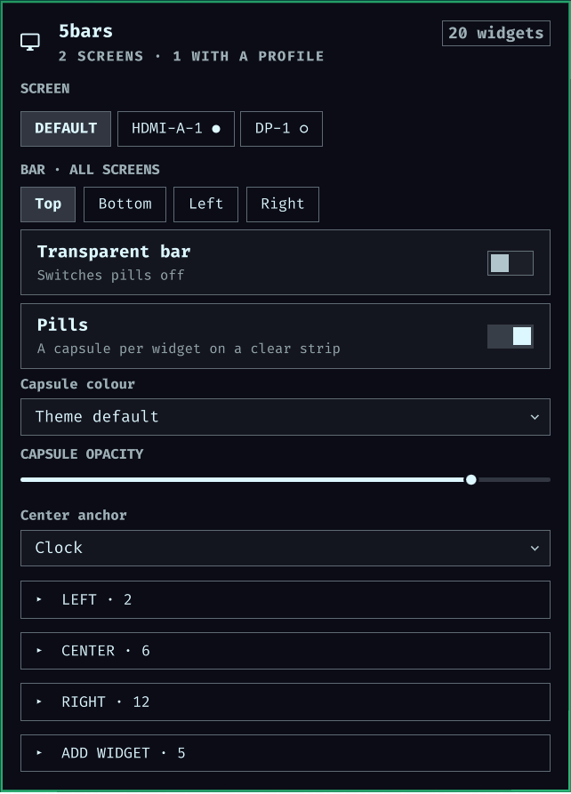
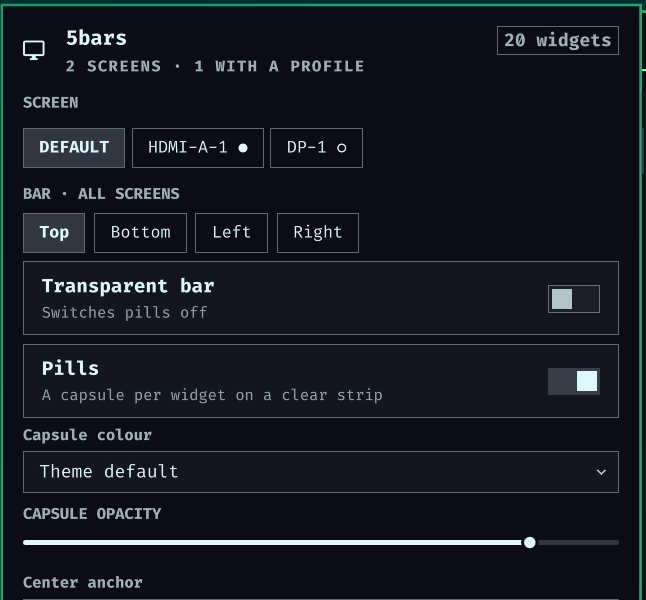
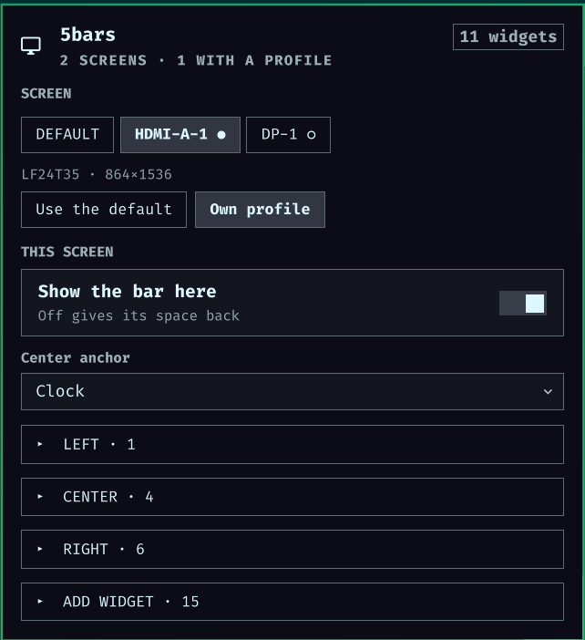
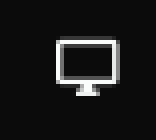

# 5bars

Per-screen bar layouts for Omarchy.

Omarchy builds one bar surface per monitor, but every one of them renders the
same `bar.layout`. That is fine until the monitors stop being alike — a 2560px
ultrawide and a 1080px screen turned on its side do not want the same eleven
widgets on the right.

5bars replaces the bar engine so each output can render a layout of its own,
while keeping everything else about the stock bar: the same widgets, the same
panels, the same drag-to-reorder, the same `omarchy bar` commands.



## How it reads config

`bar.layout` is the **default profile**. Every output renders it until that
output is given an entry under `bar.screens`:

```json
{
  "bar": {
    "id": "cinco.5bars",
    "layout": {
      "left":   [ { "id": "omarchy.menu" }, { "id": "omarchy.workspaces" } ],
      "center": [ { "id": "omarchy.clock" } ],
      "right":  [ { "id": "omarchy.tray" }, { "id": "omarchy.power" } ]
    },
    "screens": {
      "HDMI-A-1": {
        "centerAnchor": "omarchy.clock",
        "layout": {
          "left":   [ { "id": "omarchy.menu" } ],
          "center": [ { "id": "omarchy.clock", "format": "HH:mm" } ],
          "right":  [ { "id": "omarchy.power" } ]
        }
      }
    }
  }
}
```

A screen profile has the same shape as the bar subtree itself — a `layout` plus
an optional `centerAnchor` and `enabled` — so it is a bar config
in miniature rather than a second schema to learn. Output names are Hyprland's:
`hyprctl monitors`.

An output with no entry renders the default, and that is also what makes a
renamed connector a non-event. Hyprland re-enumerates outputs on a replug or a
DisplayPort link retrain, so the monitor that was `DP-1` can come back as
`DP-2`; under its new name it has no entry, so it renders the default while the
old profile sits in `shell.json` doing nothing. The panel lists that profile as
a screen which is not connected, so you can see what happened rather than
wonder why a bar changed.

`"enabled": false` removes that screen's bar entirely. The surface is destroyed
rather than parked off-screen the way the global bar-off hotkey does it, so the
exclusion zone goes back and windows use the full height of that screen.

## Pills

```json
{
  "bar": {
    "pills": true,
    "pillOpacity": 0.85,
    "layout": {
      "right": [ { "id": "omarchy.media", "pill": false } ]
    }
  }
}
```

`"pills": true` stops painting the strip and gives every widget a capsule of the
theme bar background instead, so the wallpaper shows between widgets. It is a
third look, not a flavour of `transparent`: a transparent strip has to sample
the wallpaper to pick a readable text colour, while a capsule carries its own
contrast and keeps the theme foreground. Pills therefore win — with both set,
the strip is clear because of the pills, the sampled-colour path is never
entered, and `transparent` keeps its value in the file for whenever pills are
switched off. Toggling transparency while pills are on (double-click, the
menu, `omarchy bar transparent`, the panel) flips that value **and** switches
pills off, so the gesture always lands on the look it names.

`pillOpacity` is the capsule's alpha over the theme bar background, `0` to `1`;
the default `0.85` lets a hint of wallpaper through. A widget that paints its
own backdrop opts out of the capsule with `"pill": false` on its layout entry.

Pills are global, like transparency, and for the same reason: every surface
reads the one shared foreground.

### Grouping

Give `pill` a name instead of leaving it out, and neighbours carrying the same
name share one capsule:

```json
{
  "right": [
    { "id": "omarchy.tray" },
    { "id": "omarchy.bluetooth", "pill": "sys" },
    { "id": "omarchy.network",   "pill": "sys" },
    { "id": "omarchy.audio",     "pill": "sys" },
    { "id": "omarchy.power" }
  ]
}
```

Bluetooth, network and audio become one capsule; the tray and power keep their
own. The name is only an identity — call it what you like — and it groups
neighbours, not everything that shares it: an entry between two members that
carries a different name, or none, splits the run in two.

Only widgets that are actually on the bar count. One that hides itself when it
has nothing to say — media with no player — is skipped rather than splitting
the capsule around a gap that is not there.

A group lives inside one section of one screen. The centre is split by
`centerAnchor`, so the anchor is always a capsule of its own and a group cannot
reach across it.

### Width

A capsule is as wide as the widget paints, not as wide as the slot it sits in.
The two differ for the tray: collapsed, it still holds the width its drawer
needs to slide into, which is most of its slot and all of it empty. The bar
reads that from the widget's own input mask -- the thing that keeps the empty
part unhoverable is also the only description of the painted part a widget
offers -- so the tray's capsule is chevron-sized, and grows as the drawer
opens. A widget without a mask fills its slot, as before.

## The panel

Writing `screens` blocks by hand gets old, so 5bars also ships a bar widget: a
small editor for everything above. Click its icon and you get one tab per
output, plus the default profile.

The default tab carries what belongs to the bar as a whole; a screen tab
carries what belongs to that screen.

| Default | A screen with its own profile |
|---|---|
|  |  |
| Position, **Transparent bar** and **Pills** live here, because they apply to every screen. | **Own profile** seeds a copy of the default; **Show the bar here** removes this screen's bar and gives its space back. |

It sits in the bar as a single icon:



Getting it onto the bar the first time takes a config edit:

```bash
jq '.bar.layout.right = ([{"id":"cinco.5bars"}] + .bar.layout.right)' \
  ~/.config/omarchy/shell.json > /tmp/s.json \
  && install -m600 /tmp/s.json ~/.config/omarchy/shell.json
```

`omarchy bar put cinco.5bars` looks like the right command and is not: for a
plugin declaring both a bar and a widget under one id, it means *make this the
active bar*. `setEnabled` returns from its bar-option branch before reaching any
widget placement (`PluginRegistry.qml:486`), and reports success either way — so
the only sign is that nothing moved. After the first time, the panel and drag
both work normally.

**A screen tab is opt-in.** It opens showing that the screen inherits the
default; switching it to *Own profile* seeds a copy of what that screen is
already rendering. On the monitor that needs its own bar the work is nearly
always taking things away, and seeding carries each widget's settings (clock
format, tray pins) across with it. Going back to *Use the default* deletes the
profile rather than emptying it — an empty bar is a different thing to mean.

**Removing a widget from a profile never disables the plugin.** The same widget
is very likely still on another screen.

**The add list scrolls**, so everything installed stays reachable; the search box
is a shortcut past a long catalogue, not the only way through it.

**Two things the panel will not do**, because both end with no way back short of
hand-editing `shell.json`:

- switch off the last screen still drawing a bar;
- switch off the screen whose bar carries the only copy of the 5bars widget —
  there the widget is put back on the default profile first, so the control that
  turned a screen off is still around to turn it on.

Bar position, transparency and pills belong to the bar rather than to a screen,
so they only appear on the default tab. **Not yet** says why.

## Dragging

Drag-to-reorder still works, and it writes where you would expect: dragging on a
screen that has its own profile edits that profile; dragging on a screen that is
inheriting edits the default. The bar you are dragging on is the bar you are
editing.

`omarchy bar move`, `put` and `set` write to the default profile.

## Nothing is copied

5bars changes Omarchy's bar engine, but it does not ship a modified copy of it.
At startup it reads the `Bar.qml` of the **installed** package, applies the edit
table in `edits.json` in memory, and runs the result. Two things follow:

- Upstream fixes arrive on their own. The base is whatever version is on your
  machine.
- If an Omarchy update moves the ground under an edit, 5bars loads the **stock
  bar of your own version** and says why in a notification. It never runs a
  frozen copy against a shell that has moved on.

`UPSTREAM.md` has the details, including how to check a new Omarchy release.

## Requirements

Omarchy **4.0.3 or newer** (the Quickshell shell). No external dependencies, no
daemons, no network access — everything happens inside `omarchy-shell` and
`shell.json`.

4.0.3 reworked both halves of the plugin contract: it stopped handing a
third-party bar the shell root, and it started handing third-party bar widgets
a sandboxed bar facade. The edit table is anchored on that shell. On 4.0.0–4.0.2
an anchor no longer matches, so 5bars does what it always does in that case —
loads the stock bar of your own version and tells you why. Nothing breaks; you
just get the built-in bar until you update Omarchy.

## Install

```bash
omarchy plugin add https://github.com/cinco/omarchy-5bars.git --enable --yes
omarchy bar use cinco.5bars
```

## Uninstall

```bash
omarchy bar reset
```

That returns to the built-in bar, which ignores `bar.screens` and renders
`bar.layout` — so nothing is stranded and no config needs unwinding.

## Not yet

**Per-screen bar position, and per-screen transparency.** These are one problem
wearing two hats, and the one thing here that is different in kind rather than
merely more work.

On/off is a property of a *surface*: a bar exists, or it does not, and nothing
outside it needs to know. Position is not. `position`, `vertical` and `barSize`
live on the bar root, and that root is the object injected into every widget as
`bar` — so a widget on a vertical screen and a widget on a horizontal one would
read the same `bar.vertical` and lay themselves out the same way. The bar would
move; its contents would not follow.

Transparency lands in the same place by a different road: a transparent bar
draws with a colour sampled from the wallpaper, and widgets take it from the
shared `bar.barForeground`. Let two screens disagree and that one colour is
wrong for one of them — sampled-dark text vanishes on an opaque theme
background, and forcing the theme's light text instead makes the transparent bar
unreadable over a light wallpaper. There is no third answer while the colour is
shared.

Making either per-screen means giving every widget a per-surface stand-in for
the bar root. That root exposes 141 members, and any third-party widget reaching
for one the stand-in does not forward breaks silently. It changes a contract
this plugin does not own, so it needs its own release and its own testing.

**Enabling a third-party widget from Omarchy's own plugin settings.** Setup >
Plugins, and `omarchy plugin enable`, read and write the default layout and
nothing else. A widget you have placed on one screen shows up there as
disabled, and switching it on puts it on *every* bar -- the opposite of what
you asked for. Add and remove widgets from the 5bars panel instead: it writes
the profile you are looking at.

The reason is one function. `PluginRegistry.findBarLocation` walks
`bar.layout` and stops, so every enablement question upstream answers, it
answers for the default bar. `bar.screens` is this plugin's idea and upstream
has no reason to know it exists yet. Until it does, 5bars also records a
third-party widget it places on a screen profile in the top-level `plugins`
list -- that entry means "load this", not "put it on every bar", and it is what
keeps a per-screen widget from being treated as switched off for the crime of
not being in the default layout. Taking the widget off the last screen takes
the entry back out.

## Licence

MIT. The bar engine is derived from Omarchy's own (MIT, David Heinemeier
Hansson) — see `LICENSE` and `UPSTREAM.md`.
